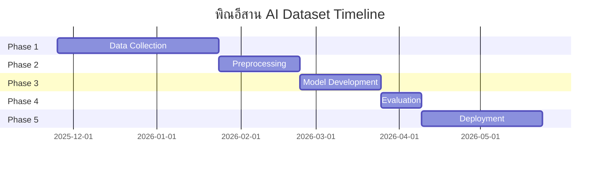

# 🎵 สรุปโปรเจค: Dataset พิณอีสาน สำหรับการเทรน AI

**วันที่สร้าง:** 25 พฤศจิกายน 2025  
**สถานะ:** Ready for Data Collection

---

## 🎯 **วัตถุประสงค์โปรเจค**

พัฒนา **AI Model** ที่สามารถ:
1. ฟังเสียงพิณอีสาน
2. แปลงเป็นโน๊ตดนตรี (Transcription)
3. สร้างไฟล์ MIDI
4. ช่วยเหลือนักเรียนและครูสอนพิณ

**เป้าหมายความแม่นยำ:** >90% (เทียบกับงานวิจัย KMUTT ที่ได้ 98.54%)

---

## ✅ **สิ่งที่เสร็จแล้ว**

### **1. โครงสร้างโปรเจค**
```
✅ สร้างโฟลเดอร์หลักทั้งหมด
✅ จัดระเบียบตามมาตรฐาน ML project
✅ พร้อมรับข้อมูล
```

### **2. เอกสารครบถ้วน (5 ไฟล์)**

| ไฟล์ | ขนาด | จุดประสงค์ | เวลาอ่าน |
|------|------|-----------|---------|
| **README.md** | 8.8 KB | ภาพรวมโปรเจค | 10 นาที |
| **quick_start_guide.md** | 13.7 KB | เริ่มต้นใช้งาน | 15 นาที |
| **phin_dataset_master_guide.md** | 16.9 KB | คู่มือฉบับเต็ม | 45 นาที |
| **youtube_sources.md** | 10.4 KB | แหล่งวิดีโอ | 20 นาที |
| **training_pipeline.md** | 20.7 KB | การเทรนโมเดล | 60 นาที |
| **REFERENCES.md** | 11 KB | อ้างอิงทั้งหมด | 30 นาที |

### **3. แหล่งข้อมูลที่รวบรวมได้**

#### **YouTube Channels (3 ช่อง):**
- ✅ ดุลย์เพลงพิณ - พื้นฐาน
- ✅ M MUSIC GROUP - เทคนิค
- ✅ สตีฟ ฐิติวัสส์ - ลายมโหรีอีสาน

#### **โน๊ตดนตรี:**
- ✅ Guitar285 WordPress (แหล่งโน๊ตหลัก)

#### **งานวิจัย (4 ชิ้น):**
- ✅ KMUTT Thai Xylophone (98.54% accuracy)
- ✅ Google Magenta Transcultural
- ✅ ACM Thai Music Classification
- ✅ Jazz Portraits of Thailand

#### **Open Source Code (6 โปรเจค):**
- ✅ Spotify Basic Pitch ⭐
- ✅ Omnizart
- ✅ NeuralNote
- ✅ wav2mid
- ✅ automatic_music_transcription
- ✅ AMT-Deep-Learning

---

## 📊 **ข้อมูลที่จะต้องรวบรวม**

### **ลายพิณ 9 ลาย (Priority Order):**

| ลาย | Priority | เป้าหมาย | สถานะ |
|-----|----------|---------|-------|
| ลายนกไส่บินข้ามทุ่ง | ⭐⭐⭐ High | 20 วิดีโอ | ⏳ 0/20 |
| ลายมโหรีอีสาน | ⭐⭐⭐ High | 20 วิดีโอ | ⏳ 1/20 |
| ลายแมลงภู่ตอมดอกไม้ | ⭐⭐⭐ High | 20 วิดีโอ | ⏳ 0/20 |
| ลายเต้ยโขง | ⭐⭐⭐ High | 15 วิดีโอ | ⏳ 0/15 |
| ลายเซิ้งบั้งไฟ | ⭐⭐⭐ High | 15 วิดีโอ | ⏳ 0/15 |
| ลายเต้ยพม่า | ⭐⭐ Medium | 10 วิดีโอ | ⏳ 0/10 |
| ลายโปงลาง | ⭐⭐ Medium | 10 วิดีโอ | ⏳ 0/10 |
| ลายลำเพลิน | ⭐⭐ Medium | 10 วิดีโอ | ⏳ 0/10 |
| ลายแห่ | ⭐⭐ Medium | 10 วิดีโอ | ⏳ 0/10 |

**รวมทั้งหมด:** 130 วิดีโอ (เป้าหมาย)  
**ปัจจุบัน:** 1 วิดีโอ (0.77%)

---

## 🗺️ **Roadmap**

### **Phase 1: Data Collection (เดือนที่ 1-2)**
```
⏳ กำลังดำเนินการ (5% complete)
```

**Tasks:**
- [ ] ดาวน์โหลดวิดีโอ 130+ ไฟล์
- [ ] รวบรวมโน๊ตดนตรี 50+ ลาย
- [ ] สร้าง metadata สำหรับแต่ละไฟล์
- [ ] จัดหมวดหมู่ตามลายพิณ

**Expected Output:**
- 130+ audio files (.wav, 22.05 kHz)
- ~13 GB disk space
- Metadata JSON files

---

### **Phase 2: Preprocessing (เดือนที่ 2-3)**
```
⏳ ยังไม่เริ่ม (0%)
```

**Tasks:**
- [ ] Audio cleaning (noise reduction)
- [ ] Segmentation (5-second clips)
- [ ] Feature extraction (Mel, CQT, Chroma)
- [ ] Data augmentation (×5)

**Expected Output:**
- 650+ processed segments
- Feature matrices (.npy)
- Train/Val/Test split (80/10/10)

---

### **Phase 3: Model Development (เดือนที่ 3-4)**
```
⏳ ยังไม่เริ่ม (0%)
```

**Approach Options:**

#### **Option A: Transfer Learning** (แนะนำ)
- Fine-tune Spotify Basic Pitch
- ใช้ pre-trained weights
- Training time: ~2-3 วัน (GPU)

#### **Option B: EWMA Method** (ตาม KMUTT)
- ไม่ต้อง deep learning
- Real-time capable
- Development time: ~1 สัปดาห์

#### **Option C: Custom CNN-RNN**
- สร้างโมเดลใหม่
- Optimized สำหรับพิณ
- Training time: ~1-2 สัปดาห์ (GPU)

**Expected Output:**
- Trained model (.h5 หรือ .pth)
- Training history
- Checkpoints

---

### **Phase 4: Evaluation (เดือนที่ 4)**
```
⏳ ยังไม่เริ่ม (0%)
```

**Metrics:**
- Onset Detection F1-score
- Pitch Detection F1-score
- Note-level accuracy
- Duration estimation error

**Target:**
- Onset F1: >95%
- Pitch F1: >90%
- Overall: >85%

---

### **Phase 5: Deployment (เดือนที่ 5-6)**
```
⏳ ยังไม่เริ่ม (0%)
```

**Deliverables:**
- [ ] Web application (Streamlit/Flask)
- [ ] Mobile app (React Native + TFLite)
- [ ] REST API
- [ ] Documentation
- [ ] GitHub repository

---

## 🛠️ **เทคโนโลยีที่ใช้**

### **Audio Processing:**
- Librosa
- SoundFile
- PyDub

### **Machine Learning:**
- TensorFlow / PyTorch
- Basic Pitch
- Omnizart

### **MIDI:**
- pretty_midi
- mido
- music21

### **Evaluation:**
- mir_eval
- jams

### **Deployment:**
- Streamlit (Web)
- FastAPI (API)
- React Native (Mobile)
- ONNX (Export)

---

## 📈 **Expected Timeline**



**ระยะเวลารวม:** ~6 เดือน  
**Expected Completion:** พฤษภาคม 2026

---

## 💰 **ประมาณการต้นทุน**

### **Infrastructure:**
| รายการ | ราคา | หมายเหตุ |
|--------|------|----------|
| Cloud Storage (100 GB) | ฟรี-$5/เดือน | Google Drive / AI Drive |
| GPU Training (A100) | $1-2/ชม. | Colab Pro / AWS |
| Total Training Time | ~100 ชม. | $100-200 |

### **Human Resources:**
| งาน | เวลา | อัตรา |
|-----|------|-------|
| Data Collection | 80 ชม. | Manual work |
| Annotation | 40 ชม. | Manual work |
| Development | 160 ชม. | Programming |
| Testing | 40 ชม. | QA |

**Total:** ~320 ชั่วโมง (~2 เดือนคน)

---

## 🎯 **Success Criteria**

### **Technical:**
- ✅ F1-score >90% on test set
- ✅ Real-time inference (<1s per 5s audio)
- ✅ MIDI export quality ≥85%

### **Usability:**
- ✅ Web interface responsive
- ✅ Mobile app < 50 MB
- ✅ API response time <500ms

### **Documentation:**
- ✅ Complete README
- ✅ API documentation
- ✅ Tutorial videos

---

## 📊 **Progress Tracking**

### **Overall Progress:**
```
████░░░░░░░░░░░░░░░░ 5% Complete

✅ Setup & Planning         [100%] ████████████
⏳ Data Collection          [  5%] █░░░░░░░░░░░
⏳ Preprocessing            [  0%] ░░░░░░░░░░░░
⏳ Model Development        [  0%] ░░░░░░░░░░░░
⏳ Evaluation               [  0%] ░░░░░░░░░░░░
⏳ Deployment               [  0%] ░░░░░░░░░░░░
```

### **Milestones:**
- [x] **2025-11-25:** Project initialized ✅
- [ ] **2025-12-25:** 50 videos collected
- [ ] **2026-01-25:** All data collected
- [ ] **2026-02-25:** Preprocessing complete
- [ ] **2026-03-25:** Model trained
- [ ] **2026-04-25:** Evaluation complete
- [ ] **2026-05-25:** Public release

---

## 🔗 **Quick Links**

### **ใน AI Drive:**
- 📁 Dataset Root: `/phin_ai_dataset/`
- 📖 Documentation: `/phin_ai_dataset/documentation/`
- 🎵 Audio Files: `/phin_ai_dataset/audio_sources/`

### **เอกสารหลัก:**
- [README.md](../README.md) - ภาพรวม
- [Quick Start Guide](quick_start_guide.md) - เริ่มต้นใช้งาน
- [Master Guide](phin_dataset_master_guide.md) - คู่มือเต็ม
- [YouTube Sources](youtube_sources.md) - แหล่งวิดีโอ
- [Training Pipeline](training_pipeline.md) - การเทรน
- [References](REFERENCES.md) - อ้างอิง

---

## 👥 **Team & Contributors**

### **Core Team:**
- **Project Lead:** [TBD]
- **ML Engineer:** [TBD]
- **Audio Engineer:** [TBD]
- **Documentation:** ✅ Complete

### **Contributors:**
- ขอบคุณทุกคนที่จะมาร่วมพัฒนา!

---

## 📞 **Contact & Support**

**หากต้องการ:**
- 💬 ถามคำถาม → อ่าน Quick Start Guide
- 🐛 รายงานปัญหา → GitHub Issues
- 🤝 มีส่วนร่วม → อ่าน Contributing Guide
- 📧 ติดต่อ → [email]

---

## 🌟 **Key Highlights**

1. **โปรเจคแรกในโลก** ที่ทำ transcription พิณอีสานด้วย AI
2. **Open Source** - เปิดให้ทุกคนใช้และพัฒนาต่อ
3. **Complete Documentation** - เอกสารครบถ้วน 74KB+
4. **Research-backed** - อ้างอิงงานวิจัยคุณภาพสูง
5. **Culturally Sensitive** - เข้าใจระบบดนตรีไทย (7-tone)

---

## 🏆 **Expected Impact**

### **การศึกษา:**
- นักเรียนพิณสามารถเรียนรู้เร็วขึ้น
- ครูสามารถให้ feedback แม่นยำขึ้น
- สร้างสื่อการเรียนรู้อัตโนมัติ

### **การอนุรักษ์:**
- บันทึกลายพิณในรูปแบบดิจิทัล
- ป้องกันการสูญหายของภูมิปัญญา
- เผยแพร่ดนตรีไทยสู่สากล

### **วิชาการ:**
- งานวิจัยใหม่เกี่ยวกับ transcultural ML
- เปิดทางให้เครื่องดนตรีไทยอื่นๆ
- สร้างมาตรฐานใหม่สำหรับดนตรีไทย

---

## ⚡ **Next Immediate Actions**

### **วันนี้ - สัปดาห์หน้า:**
1. ✅ Setup complete! (เสร็จแล้ว)
2. ⏳ เริ่มดาวน์โหลดวิดีโอ 3 ไฟล์แรก
3. ⏳ ทดลอง Basic Pitch กับเสียงพิณ
4. ⏳ สร้าง GitHub repository

### **สัปดาห์ที่ 2-4:**
1. ดาวน์โหลดต่อ 20 วิดีโอ
2. เริ่ม preprocessing pipeline
3. หา ground truth MIDI
4. ทดลอง data augmentation

---

## 💡 **Lessons Learned (จะอัปเดตต่อเนื่อง)**

_ส่วนนี้จะเพิ่มเติมเมื่อเริ่มทำงาน_

---

**สร้างเมื่อ:** 25 พฤศจิกายน 2025  
**Last Updated:** 25 พฤศจิกายน 2025  
**Version:** 1.0  
**Status:** 🟢 Active Development

---

**🎵 สร้างด้วย ❤️ เพื่อการอนุรักษ์และพัฒนาดนตรีไทย 🎵**
